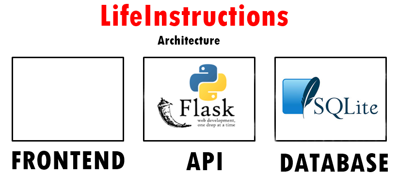

<h1 align="center"> FelipedelosH </h1>
<br>
<h4>LifeInstructions API</h4>


:construction: IN CONSTRUCTION :construction:
<br><br>
This it´s my API for my first book, simulates a simple life, be you want to be. Smile, Hate, Love and death. you hav freewill.

## :hammer:Funtions:

- `Function 1`: Player register<br>
- `Function 2`: Neque porro quisquam est qui dolorem ipsum quia dolor sit amet.<br>
- `Function 3`: Neque porro quisquam est qui dolorem ipsum quia dolor sit amet.<br>
- `Function 3a`: Neque porro quisquam est qui dolorem ipsum quia dolor sit amet.<br>
- `Function 4`: Neque porro quisquam est qui dolorem ipsum quia dolor sit amet.<br>


## Install requirements.txt

pip install -r requirements.txt

## :play_or_pause_button:How to execute a project

python run.py

## API Response format

```
{
    "status": boolean,
    "data": [],
    "code": number
}
```

## Endpoints

GET http://localhost:5000/health

POST http://localhost:5000/register_player

```
{
    "name": string,
    "age": number
}
```

GET http://localhost:5000/get_player/<id>

POST http://localhost:5000/take_option_activity

```
{
    "player_id": #,
    "actions": "action"
}
```

## :hammer_and_wrench:Tech.

- Python.
- Flask.

## :warning:Warning.

- PROJECT 1% complete

## Autor

| [<br><sub>Andrés Felipe Hernánez</sub>](https://github.com/felipedelosh)|
| :---: |